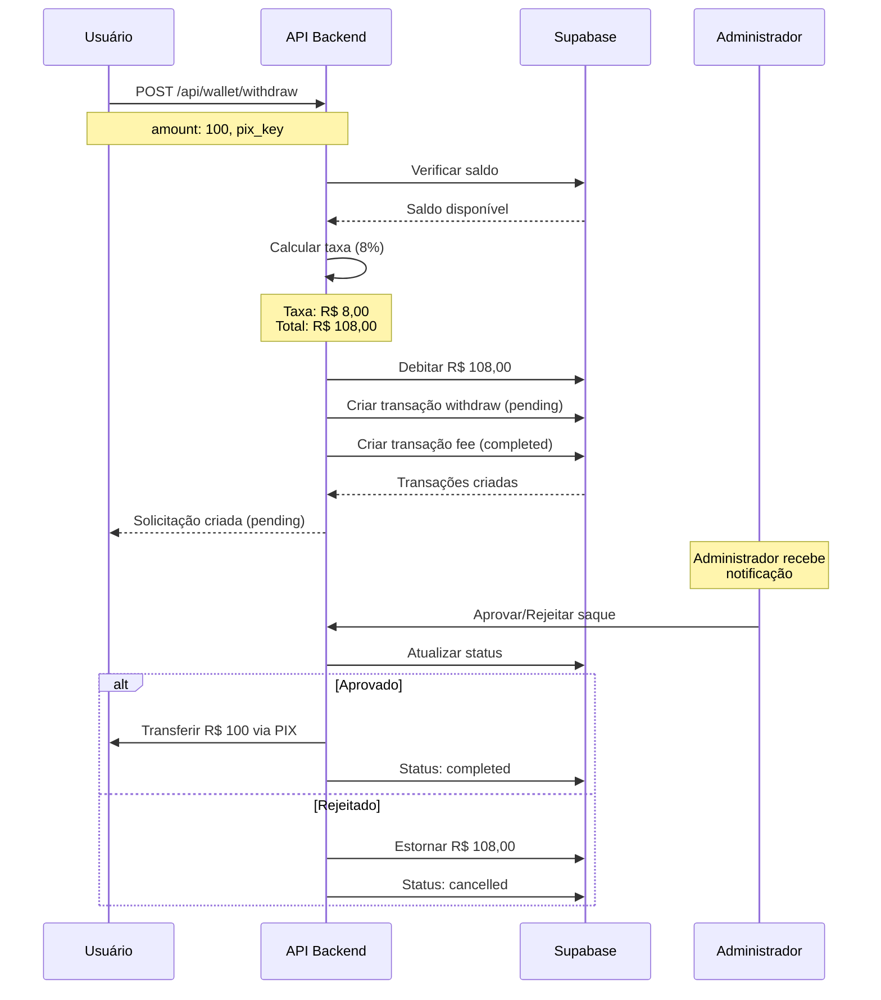

# 💰 API de Saque (Withdraw)

## Visão Geral

O endpoint de saque permite que usuários autenticados solicitem transferências de saldo via PIX. O sistema cobra uma **taxa de 8%** sobre o valor do saque e aguarda aprovação do administrador antes de processar a transferência.

---

## 📋 Endpoint

### POST `/api/wallet/withdraw`

**Autenticação:** Obrigatória (Bearer Token)  
**Rate Limit:** 3 solicitações por hora

---

## 📥 Requisição

### Headers

```http
Authorization: Bearer {token}
Content-Type: application/json
```

### Body

```json
{
  "amount": 100.00,
  "pix_key": "usuario@email.com",
  "description": "Saque de prêmio" // opcional
}
```

### Parâmetros

| Campo | Tipo | Obrigatório | Descrição | Validação |
|-------|------|-------------|-----------|-----------|
| `amount` | number | Sim | Valor do saque | Mín: R$ 20,00<br>Máx: R$ 50.000,00<br>2 casas decimais |
| `pix_key` | string | Sim | Chave PIX para recebimento | Máx 255 caracteres |
| `description` | string | Não | Descrição opcional | Máx 255 caracteres |

---

## 📤 Resposta de Sucesso

**Status:** `201 Created`

```json
{
  "success": true,
  "message": "Solicitação de saque criada com sucesso",
  "data": {
    "transaction_id": "uuid-da-transacao",
    "status": "pending",
    "amount_requested": 100.00,
    "fee": 8.00,
    "total_debited": 108.00,
    "net_to_receive": 100.00,
    "new_balance": 392.00,
    "pix_key": "usuario@email.com",
    "created_at": "2025-01-15T10:30:00.000Z",
    "message": "Solicitação de saque criada com sucesso. Aguardando confirmação do administrador.",
    "note": "O valor líquido será transferido para sua chave PIX após aprovação do admin."
  }
}
```

### Campos da Resposta

| Campo | Tipo | Descrição |
|-------|------|-----------|
| `transaction_id` | string | ID único da transação de saque |
| `status` | string | Status da solicitação (sempre `pending` inicialmente) |
| `amount_requested` | number | Valor líquido solicitado pelo usuário |
| `fee` | number | Taxa de 8% cobrada |
| `total_debited` | number | Valor total debitado da carteira (amount + fee) |
| `net_to_receive` | number | Valor líquido que será recebido via PIX |
| `new_balance` | number | Novo saldo da carteira após o débito |
| `pix_key` | string | Chave PIX informada para recebimento |
| `created_at` | string | Data/hora da criação da solicitação |

---

## ❌ Erros Possíveis

### 400 - Saldo Insuficiente

```json
{
  "success": false,
  "message": "Saldo insuficiente para realizar o saque",
  "details": {
    "available": 50.00,
    "required": 108.00,
    "amount": 100.00,
    "fee": 8.00
  }
}
```

### 400 - Validação de Dados

```json
{
  "success": false,
  "message": "Erro de validação",
  "errors": [
    {
      "field": "amount",
      "message": "O valor mínimo de saque é R$ 20,00"
    },
    {
      "field": "pix_key",
      "message": "Chave PIX é obrigatória para saque"
    }
  ]
}
```

### 401 - Não Autenticado

```json
{
  "success": false,
  "message": "Token de autenticação não fornecido"
}
```

### 404 - Carteira não Encontrada

```json
{
  "success": false,
  "message": "Carteira não encontrada"
}
```

### 429 - Rate Limit Excedido

```json
{
  "success": false,
  "message": "Você atingiu o limite de saques por hora. Tente novamente mais tarde."
}
```

### 500 - Erro Interno

```json
{
  "success": false,
  "message": "Erro ao processar saque"
}
```

---

## 🔄 Fluxo de Funcionamento



---

## 💡 Detalhes Importantes

### 📊 Cálculo da Taxa

- **Taxa:** 8% sobre o valor solicitado
- **Fórmula:** `fee = amount * 0.08`
- **Total debitado:** `amount + fee`
- **Valor a receber:** `amount` (valor líquido)

**Exemplo:**
- Saque solicitado: R$ 100,00
- Taxa (8%): R$ 8,00
- Total debitado da carteira: R$ 108,00
- Valor a receber no PIX: R$ 100,00

### 📝 Transações Criadas

O sistema cria **duas transações** para cada saque:

1. **Transação de Saque (withdraw)**
   - Tipo: `withdraw`
   - Status: `pending` (aguardando admin)
   - Amount: Valor líquido
   - Fee: Taxa de 8%

2. **Transação de Taxa (fee)**
   - Tipo: `fee`
   - Status: `completed` (imediata)
   - Amount: Valor da taxa
   - Metadados: Referência ao saque

### 🔐 Segurança

- Rate limit de 3 saques por hora por IP
- Verificação de saldo disponível (balance - blocked_balance)
- Rollback automático em caso de erro
- Chave PIX armazenada no metadata da transação

### ⚠️ Observações

- O saldo é debitado **imediatamente** ao criar a solicitação
- O status inicial é sempre `pending`
- O administrador deve aprovar a transferência
- Se rejeitado, o valor é estornado automaticamente
- Valores mínimo: R$ 20,00
- Valor máximo: R$ 50.000,00

---

## 📋 Exemplo de Uso

### JavaScript (Fetch)

```javascript
const token = 'seu-token-jwt';

const response = await fetch('http://localhost:5000/api/wallet/withdraw', {
  method: 'POST',
  headers: {
    'Authorization': `Bearer ${token}`,
    'Content-Type': 'application/json'
  },
  body: JSON.stringify({
    amount: 100.00,
    pix_key: 'usuario@email.com',
    description: 'Saque de prêmio'
  })
});

const data = await response.json();
console.log(data);
```

### cURL

```bash
curl -X POST http://localhost:5000/api/wallet/withdraw \
  -H "Authorization: Bearer seu-token-jwt" \
  -H "Content-Type: application/json" \
  -d '{
    "amount": 100.00,
    "pix_key": "usuario@email.com",
    "description": "Saque de prêmio"
  }'
```

### Python (Requests)

```python
import requests

token = 'seu-token-jwt'
url = 'http://localhost:5000/api/wallet/withdraw'

headers = {
    'Authorization': f'Bearer {token}',
    'Content-Type': 'application/json'
}

data = {
    'amount': 100.00,
    'pix_key': 'usuario@email.com',
    'description': 'Saque de prêmio'
}

response = requests.post(url, headers=headers, json=data)
print(response.json())
```

---

## 🧪 Testes

Execute o script de testes:

```bash
chmod +x TEST_WITHDRAW_ENDPOINT.sh
./TEST_WITHDRAW_ENDPOINT.sh
```

O script testa:
1. ✅ Login e obtenção do token
2. ✅ Consulta de saldo antes do saque
3. ✅ Criação de saque válido
4. ✅ Verificação do saldo após saque
5. ✅ Saque com saldo insuficiente
6. ✅ Validação de valor mínimo
7. ✅ Validação de chave PIX obrigatória

---

## 🔗 Endpoints Relacionados

- `GET /api/wallet` - Consultar saldo e transações
- `POST /api/wallet/deposit` - Criar depósito via PIX
- `GET /api/wallet/transactions` - Listar todas as transações

---

## 📞 Suporte

Para dúvidas ou problemas, consulte:
- [Documentação da Carteira](./WALLET_API.md)
- [Exemplos de API](./API_EXAMPLES.md)
- [Troubleshooting](../docs/TROUBLESHOOTING.md)


